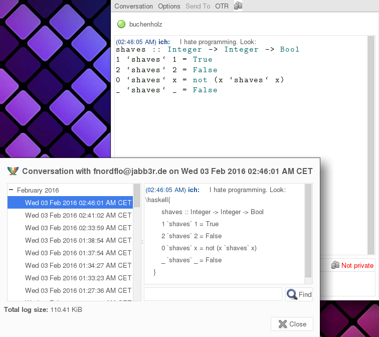
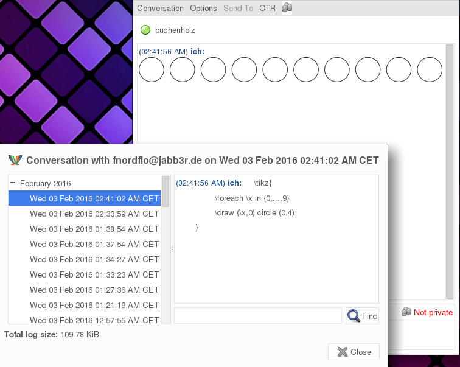

# Description
PiFo is a plugin for the chat program [pidgin](https://www.pidgin.im/)
It enables you to render various latex markups and procedural graphics code
embedded into your normal conversation.

You can
* highlight your sourcecode using the [listings](http://ctan.org/pkg/listings) package for LaTeX,
* display some maths using the [amsmath](http://ctan.org/pkg/amsmath) packages,
* generate neat looking [graphivz](http://graphviz.org/) graphs from dot code,
* render extended [markdown](https://daringfireball.net/projects/markdown/) using [pandoc](http://pandoc.org/README.html#pandocs-markdown) or
* compile and view [TikZ](https://en.wikibooks.org/wiki/LaTeX/PGF/TikZ) procedural graphics.

In a certain way, you could think of PiFo as an integrated REPL for 
various markup and procedural graphics languages.

# Demo

Right now, there are two demos. The first
demo shows formula rendering and code highlighting.
The second shows the newest feature: Embedded graphvzi rendering :)

# Requirements
- The pidgin header files (needed to compile the plugin)
- A LaTex-Distribution
- dvipng
- latex
- graphviz

# Usage in detail
You can markup some of your text via the following
construct (embedded into your normal conversation)

    <normal conversation text> 
    \command{your formula, dot code or whatever} 
    <additional conversation text>

If a command is detected, it'll be dispatched to one of the rendering
backends and the result is displayed nicely enclosed by your 
surrounding text. Note, that you can use arbitrarily many of those
commands in your messages!

Here is a list of examples. The shown code
can be pasted directly into your conversation window.

## Graphivz dot
Display of graphviz dot code

    Hey, look at following graph! \dot{digraph foo {a->a->a->a;}}
    

## Latex maths

    Hey, i found out that I can create the set of natural
    numbers by describing them inductively. I use the Axiom
    \formula{\frac{}{n}} and the rule \formula{\frac{n}{n+1}}

## Sourcecode hightlighting
Use the following snippet for C programs

    Not an iteration in C: \c{
        int main(void){ 
            return 0; 
        }
    }

or use this one for highlighting haskell sources

    I hate programming. Look: \haskell{
        shaves :: Integer -> Integer -> Bool
        1 `shaves` 1 = True
        2 `shaves` 2 = False
        0 `shaves` x = not (x `shaves` x)
        _ `shaves` _ = False
    }
    
the latter code is equivalent to latex code:

	\usepackage{listings}
	\lstset{language=haskell}
	% [...] various other lstset
	\begin{document}
	\begin{lstlisting}
	shaves :: Integer -> Integer -> Bool
        1 `shaves` 1 = True
        2 `shaves` 2 = False
        0 `shaves` x = not (x `shaves` x)
        _ `shaves` _ = False
	\end{lstlisting}
	

    
## TikZ compilation

If you want to create TikZ graphics inside your conversation, you
would want to paste the following snippet into your conversation.

	\tikz{
		\foreach \x in {0,...,9} 
		\draw (\x,0) circle (0.4);
	}
	
this is equivalent to this LaTeX code

	\documentclass{article}
	\usepackage{tikz}
	\begin{document}
	\begin{tikzpicture}
		\foreach \x in {0,...,9} 
		\draw (\x,0) circle (0.4);
	\end{tikzpicture}

# Complete command list

Hiere is a list of all commands that will be recognized

* \ada{}
* \haskell{}
* \bash{}
* \awk{}
* \c{}
* \cpluscplus{}
* \html{}
* \lua{}
* \make{}
* \octave{}
* \perl{}
* \python{}
* \ruby{}
* \vhdl{}
* \verilog{}
* \xml{}
* \dot{}
* \formula{}

\ada{} to \xml{} hightlights source code.
\dot{} renders arbitrary graphiz dot code
and \formula{} can be used to display common
LateX math markup.

# Important notes

This plugin uses various command line utilities and
calls them in background in order to render the
available markups depicted in chapter `command list`.
Some markup languages like TeX are turing-complete,
Which means, that it is, in general, not possible
to decide which code-strings are malicious or not.

Actually, the commandline tools should only be called
in a proper sandbox. This, however would requre a bit
more work and I simply don't have the time right now and
don't know exactly how to do that at this point of time.
Patches are thus very welcome!

Please, only activate the plugin if you know _all_
your contacts.

# Building and installation
To build and install :

You can compile the plugin using

	$ make

and install it with

	$ make install

This will install it in ~/.purple/plugins so 
that only the user who installed it can use it.

To install it for everybody on your computer,

	$ make
	$ su
	# make install PREFIX="/path/to/pidgin" (this command as root user)

generally /path/to/pidgin is /usr or /usr/local. If you don't know the path then you can find out using

	$ whereis pidgin

and look for the part before "/lib/pidgin".

